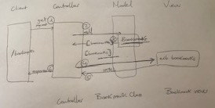

# User stories
# Bookmark Manager

As an internet user,
So that I can easily return to the pages that are important to me,
I want to be able to see the list of the pages that I've bookmarked.

As an internet user,
So that I can easily find it later,
I want to be able to mark the page that I'm reading.

## Domain Model

# Bookmark_manager
# How to use

To set up the project

Clone this repository and then run:

bundle
To set up the database

Connect to psql and create the bookmark_manager database:

CREATE DATABASE bookmark_manager;
To set up the appropriate tables, connect to the database in psql and run the SQL scripts in the db/migrations folder in the given order.

To run the Bookmark Manager app:

rackup -p 3000
To view bookmarks, navigate to localhost:3000/bookmarks.

To run tests:

rspec
To run linting:

rubocop

# Setting up a Testing Environment

Run the commands in psql from the db/migrations/01_create_bookmarks_table.sql


# Add new bookmarks

```
As an internet user
so that I can store pages that I want to visit
I want to be able to add a bookmark to my list
```